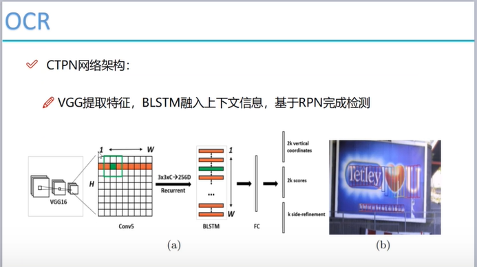
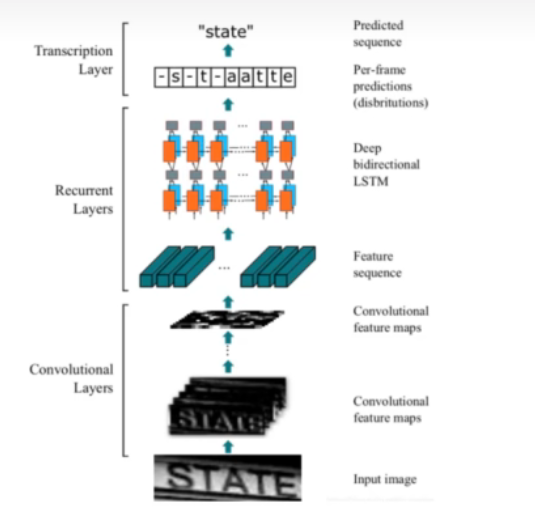

# OCR文字识别项目实战
OCR 即光学字符识别（Optical Character Recognition），是一种将图像或扫描文档中的文本转换为可编辑、可搜索的文本数据的技术。

该项目使用CTPN+CRNN模型进行文字识别，其中CTPN用于检测文字区域，CRNN用于识别文字内容。

运行环境：
- Python 3.9.21
- CUDA 12.6
- torch 2.6.0+cu124
- torchvision 0.21.0+cu124

主要内容：
- demo OCR文字识别DEMO
- test_one 单图片OCR文字识别

运行命令：python .\test_one.py .\test_images\t1.png

详见[唐宇迪B站Pytorch课程](https://www.bilibili.com/video/BV1rg411d7KT?spm_id_from=333.788.videopod.episodes&vd_source=aaa85a47471179fcdb4e51e332c391e1&p=74)

项目来源：[@ZoeEsther/OCR](https://github.com/ZoeEsther/OCR/tree/master)