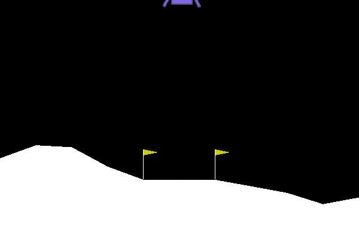

# 策略梯度实战-月球登陆器训练实例
PPO是OpenAI在2017年提出的无模型强化学习算法，属于策略梯度方法，用于优化策略网络以最大化累积奖励。

PPO通过限制策略更新的步长，避免策略更新过大导致性能下降。PPO有两种主要变体：PPO - Clip和PPO - KL，前者通过裁剪策略比率来限制更新，后者通过KL散度来控制更新幅度。

运行环境：
- Python 3.7.16
- CUDA 12.6
- torch 1.11.0+cu113
- pygame 2.6.1
- gym 0.21.0
- Box2D 2.3.10
- Box2D-kengz 2.3.3
- swig 4.3.1

主要内容：
- PPO 基于PPO网络进行LunarLander-v2游戏的强化学习（耗时较长）
- test 基于训练好的PPO网络进行LunarLander-v2游戏的测试

- PPO_continuous 基于PPO网络进行BipedalWalker-v3游戏的强化学习（耗时较长）
- test_continuous 基于训练好的PPO网络进行BipedalWalker-v3游戏的测试

详见[唐宇迪B站Pytorch课程](https://www.bilibili.com/video/BV1FL411f7YR?spm_id_from=333.788.videopod.episodes&vd_source=aaa85a47471179fcdb4e51e332c391e1&p=7)

项目来源：[@yanjingke/PPO-PyTorch](https://github.com/yanjingke/PPO-PyTorch)